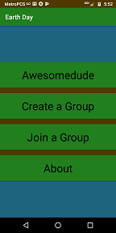

# EarthDay

Users can create and join Earth Day Groups. Groups have an earthday action assigned by the group leader. Group leaders can enable and disable "EarthDay". It is intended for members to carry out the group action when "EarthDay" is enabled.

## Vision:

This app was created in hopes that youths would stand up to the pollution causing global warming.

## Google Play Link:

https://play.google.com/store/apps/details?id=com.earthday

## Related Links:

https://austin6486.artstation.com/ 
https://welovetheearth.org/ 
https://climate.nasa.gov/

## Screenshots:

